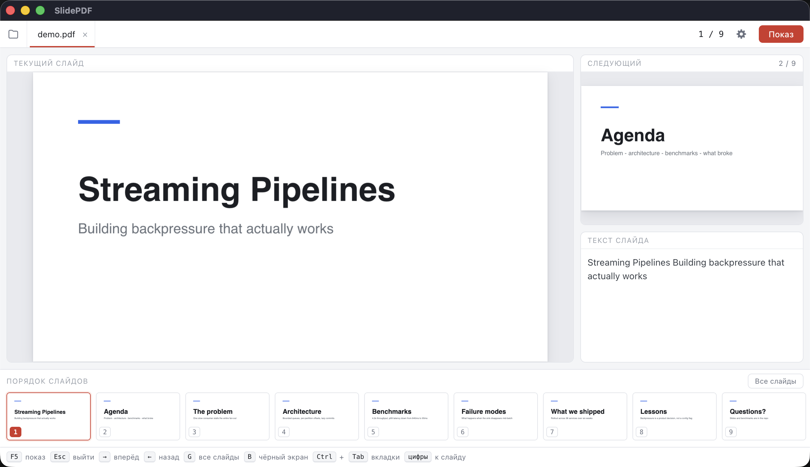

# SlidePDF

[English](README.md) · **Русский**

[](https://github.com/djdrise/SlidePDF/releases/latest)
[](https://github.com/djdrise/SlidePDF/actions/workflows/check.yml)
[](LICENSE)

Мультиплатформенный просмотрщик PDF для докладов на конференциях: слайд уходит
на проектор/внешний экран, а на ноутбуке остаётся режим лектора с порядком
слайдов, следующим слайдом и текстом слайда. Несколько презентаций
открываются вкладками. Интерфейс светлый и намеренно простой.

macOS · Windows · Linux (Electron + pdf.js).



## Установка

Готовые сборки — на странице
[Releases](https://github.com/djdrise/SlidePDF/releases): `.dmg` для macOS
(отдельно Apple Silicon и Intel), `.exe` для Windows (установщик и портативный)
и `.AppImage` / `.deb` для Linux.

Сборки не подписаны цифровым сертификатом, поэтому при первом запуске:

* **macOS** — приложение подписано ad-hoc, но не заверено у Apple, поэтому
  система спросит разрешение. Откройте «Системные настройки» → «Конфиденциальность
  и безопасность», найдите сообщение о SlidePDF и нажмите «Всё равно открыть».
  На macOS 14 и старше работает и правый клик по программе → «Открыть».
  Если система пишет, что приложение повреждено, снимите карантин:
  `xattr -dr com.apple.quarantine /Applications/SlidePDF.app`
* **Windows** — SmartScreen покажет предупреждение: «Подробнее» → «Выполнить
  в любом случае».
* **Linux** — `.AppImage` нужно сделать исполняемым: `chmod +x SlidePDF-*.AppImage`.

## Запуск из исходников

Нужен Node.js 20 или новее.

```bash
npm install
npm start                 # или: npm start -- путь/к/презентации.pdf
npm run dev               # то же самое, плюс лог renderer-процессов в терминал
```

> `npm start` идёт через `scripts/start.js`: терминал VS Code выставляет
> `ELECTRON_RUN_AS_NODE=1`, с которой Electron стартует как обычный Node и
> приложение падает. Лаунчер чистит эту переменную.

## Проверка

```bash
npm run check     # синтаксическая проверка всех исходников
npm test          # тесты чистой логики показа
```

Тесты написаны на встроенном в Node раннере (`node --test`), без единой
зависимости. Покрыта чистая логика из
[`src/main/lib/deck.js`](src/main/lib/deck.js): границы номера страницы,
порядок вкладок, выбор экрана. Остальное в main завязано на окна и дисплеи
Electron и проверяется только запуском — поэтому `npm run check` ловит
опечатки до старта. Обе команды гоняет GitHub Actions.

## Сборка установщиков

```bash
npm run dist:mac      # dmg + zip
npm run dist:win      # nsis + portable
npm run dist:linux    # AppImage + deb
```

electron-builder собирает только под текущую ОС: кросс-сборка под Windows
требует wine, а Linux-сборка на macOS не поддерживается. Поэтому релизы
собираются на GitHub Actions — по одной задаче на каждую ОС, workflow
[`release.yml`](.github/workflows/release.yml) срабатывает на тег `v*`:

```bash
git tag v0.1.0 && git push origin v0.1.0
```

## Как работают экраны

Окно зрителей на старте не появляется вовсе — только по «Показ»
(<kbd>F5</kbd>), и уходит с глаз, когда показ закончен. Пока файл не открыт,
показ не запускается вовсе: кнопка и пункт меню выключены, иначе на проектор
ушло бы приглашение открыть файл. Открыть его заранее,
чтобы посмотреть, что увидит зал, можно вручную: пункт «Показать/скрыть окно
зрителей» в меню.

Экран для показа приложение выбирает само:

* **Есть внешний экран** — слайд уйдёт на него, режим лектора останется на
  встроенном.
* **Экран один** — показ развернётся поверх окна лектора.
* Проектор подключили или отключили прямо во время доклада — `display-added` /
  `display-removed` пересобирают раскладку на лету, а идущий показ переезжает
  на нужный экран, не прерываясь. Сам по себе показ при этом не начинается.
* Автоматику можно перебить вручную: шестерёнка в шапке открывает настройки со
  списком экранов, где выбирается тот, на который уходит слайд. После ручного
  выбора автоматика экран показа больше не переназначает — до тех пор, пока
  выбранный монитор не отключат.

Оба окна рендерят PDF независимо из одних и тех же байтов, а состояние — текущий
слайд, чёрный экран, активная вкладка — живёт в main-процессе и рассылается
обоим. Окно зрителей не может «отстать» от окна лектора.

## Показ

Запускается и завершается по <kbd>F5</kbd>. Окно зрителей создаётся без рамки
(`frame: false`), поэтому на экране нет ничего, кроме слайда; в режиме превью
(когда экран один) оно вместо системной рамки получает собственную
полоску-заголовок, за которую его можно таскать.

Показ появляется сразу готовым. Пока меняется геометрия окна, оно держится
прозрачным и показывается только после того, как renderer подтвердил, что
перерисовал слайд под новый размер. Иначе было бы видно, как окно растягивается
из превью, а слайд догоняет полный экран уже на глазах у зала. На macOS показ
разворачивается через `simpleFullScreen`, чтобы не создавался отдельный Space
с анимацией перехода.

**Стоп-кадр** (<kbd>F</kbd>) отвязывает зал от вашей навигации: экран зрителей
замирает на текущем слайде, а вы листаете колоду у себя — найти слайд к вопросу,
свериться с цифрой, вернуться. Зал ничего этого не видит. Ни переходы, ни смена
вкладки стоп-кадр не снимают, только повторное нажатие или конец показа; в шапке
всё это время висит напоминание, на чём остался зал, а в ленте слайд отмечен.

Фокус сразу переходит на полноэкранное окно, так что кликер и клавиши бьют
в показ. Курсор мыши в нём прячется — и мгновенно на старте, и через две
секунды после того, как мышь перестали двигать.

## Режим лектора

* Несколько презентаций открываются вкладками: <kbd>Ctrl</kbd>+<kbd>Tab</kbd>
  вперёд, <kbd>Shift</kbd>+<kbd>Tab</kbd> назад, крестик на вкладке или
  <kbd>Cmd/Ctrl</kbd>+<kbd>W</kbd> — закрыть. Каждая вкладка помнит свою
  страницу; в диалоге и перетаскиванием можно открыть сразу несколько файлов.
* Крупно — текущий слайд, рядом — следующий.
* **Порядок слайдов**: лента миниатюр внизу и полноэкранная сетка всех слайдов
  (<kbd>G</kbd>). В сетке стрелки двигают выделение, не трогая экран зрителей,
  переход происходит по <kbd>Enter</kbd> или клику.
* Текст текущего слайда — как подсказка вместо заметок.
* Счётчик слайдов и индикатор состояния экранов — оба появляются только
  тогда, когда им есть что показать.
* В настройках можно включить «Открывать последние файлы»: программа запомнит
  открытые вкладки и вернёт их при следующем запуске вместе с той, на которой
  вы закончили. По умолчанию выключено, и пока выключено — пути никуда не
  записываются. Файлы из командной строки важнее сохранённых, а те, что
  переехали или удалены, пропускаются молча.

## Клавиши

| Клавиша | Действие |
| --- | --- |
| <kbd>→</kbd> <kbd>↓</kbd> <kbd>Space</kbd> <kbd>PageDown</kbd> | следующий слайд |
| <kbd>←</kbd> <kbd>↑</kbd> <kbd>PageUp</kbd> <kbd>Backspace</kbd> | предыдущий слайд |
| <kbd>Home</kbd> / <kbd>End</kbd> | первый / последний слайд |
| цифры, затем <kbd>Enter</kbd> | перейти к слайду по номеру |
| <kbd>G</kbd> | сетка всех слайдов |
| <kbd>Ctrl</kbd>+<kbd>Tab</kbd> / <kbd>Shift</kbd>+<kbd>Tab</kbd> | следующая / предыдущая вкладка |
| <kbd>B</kbd> | чёрный экран у зрителей |
| <kbd>F</kbd> | стоп-кадр: зал остаётся на слайде, вы листаете свободно |
| <kbd>F5</kbd> | начать / завершить показ |
| <kbd>O</kbd> | открыть PDF |
| <kbd>Esc</kbd> | закрыть сетку, снять чёрный экран, завершить показ |

Слайды листаются и колесом мыши — в обоих окнах. Над лентой миниатюр, текстом
слайда и сеткой колесо прокручивает их содержимое, а не листает.

Клавиши слушают оба окна, поэтому презентер-кликер (он шлёт PageUp/PageDown)
работает независимо от того, какое окно в фокусе. Раскладка учитывает и русские
буквы на тех же клавишах.

## Логотип

Знак — колода слайдов: три карточки одного размера, сдвинутые по диагонали.
Плитка коралловая: в панели задач, где почти всё синее и серое, тёплый цвет
заметно выделяется.

```
assets/logo.svg             знак для интерфейса (двухцветный, на светлом фоне)
assets/icon.svg             иконка приложения — белый знак на коралловой плитке
assets/icon-small.svg       упрощённый знак для мелких размеров иконки
assets/icon.png             1024×1024, из неё electron-builder делает .icns
assets/icon.ico             16…256 для Windows
assets/file-icon.svg        значок PDF-файла — страница с надписью
assets/file-icon-small.svg  упрощённый значок файла для 16–32 px
assets/file-icon.png        1024×1024
assets/file-icon.ico        16…256, значок файла в проводнике Windows
assets/file-icon.icns       16…1024, значок файла в Finder
```

`npm run icon` пересобирает все эти файлы из SVG силами Chromium: сторонних
конвертеров SVG в системе может не быть, а Electron уже установлен. Скрипт
самозапускается — под обычным Node он перезапускает себя в Electron.

`.ico` и `.icns` собираем сами, а не отдаём electron-builder: тот ужимает одну
картинку 1024×1024 сразу до всех размеров, и уменьшение в 64 раза размывает
детали. Здесь каждый размер растрируется из вектора отдельно, в натуральную
величину, а мелкие — из упрощённых исходников. У иконки приложения это две
карточки вместо трёх и смещение крупнее: на 16 пикселях сдвиг третьей карточки
меньше пикселя и она сливается с соседней. У значка файла надпись «PDF»
заменяется сплошной полосой — три буквы на восемь точек превращаются в грязь.

## Связь с PDF-файлами

Установщик регистрирует программу как средство просмотра PDF, и файлы можно
открывать двойным кликом или через «Открыть с помощью». Работает на всех трёх
системах: macOS получает файл событием `open-file`, Windows и Linux — аргументом
командной строки. Повторный запуск с файлом не плодит второе окно, а передаёт
файл уже открытому — новой вкладкой.

Программа объявляет себя просмотрщиком, а не владельцем формата: она не
перехватывает PDF у системного просмотрщика, выбор остаётся за вами.

## Структура

```
src/main/main.js        дисплеи, окна, состояние показа, меню
src/main/lib/deck.js    чистая логика: страницы, вкладки, выбор экрана
src/main/lib/layout.js  решение о раскладке окон по дисплеям
src/preload/preload.js  contextBridge: команды, подписки, путь файла из drag&drop
src/renderer/
  presenter.*           режим лектора
  audience.*            экран зрителей
  lib/pdfview.js        обёртка pdf.js: документ, слайд «по размеру», миниатюры
  lib/keys.js           общая раскладка клавиш и drag&drop
scripts/start.js        лаунчер, чистящий ELECTRON_RUN_AS_NODE
scripts/make-icon.js    сборка assets/icon.png из assets/icon.svg
scripts/check.js        синтаксическая проверка исходников
test/                   тесты чистой логики
assets/                 логотип и иконка приложения
docs/                   скриншот для README
```

Окна изолированы: `contextIsolation: true`, `nodeIntegration: false`, CSP
запрещает любые сетевые запросы — PDF с внешними ссылками ничего не подгрузит.

## Лицензия

GNU General Public License v3.0 или новее — полный текст в [LICENSE](LICENSE).

> SlidePDF is free software: you can redistribute it and/or modify it under
> the terms of the GNU General Public License as published by the Free Software
> Foundation, either version 3 of the License, or (at your option) any later
> version. It is distributed in the hope that it will be useful, but WITHOUT ANY
> WARRANTY; without even the implied warranty of MERCHANTABILITY or FITNESS FOR
> A PARTICULAR PURPOSE. See the GNU General Public License for more details.

Сторонние компоненты: [pdf.js](https://github.com/mozilla/pdf.js) (Apache-2.0)
и [Electron](https://github.com/electron/electron) (MIT).
